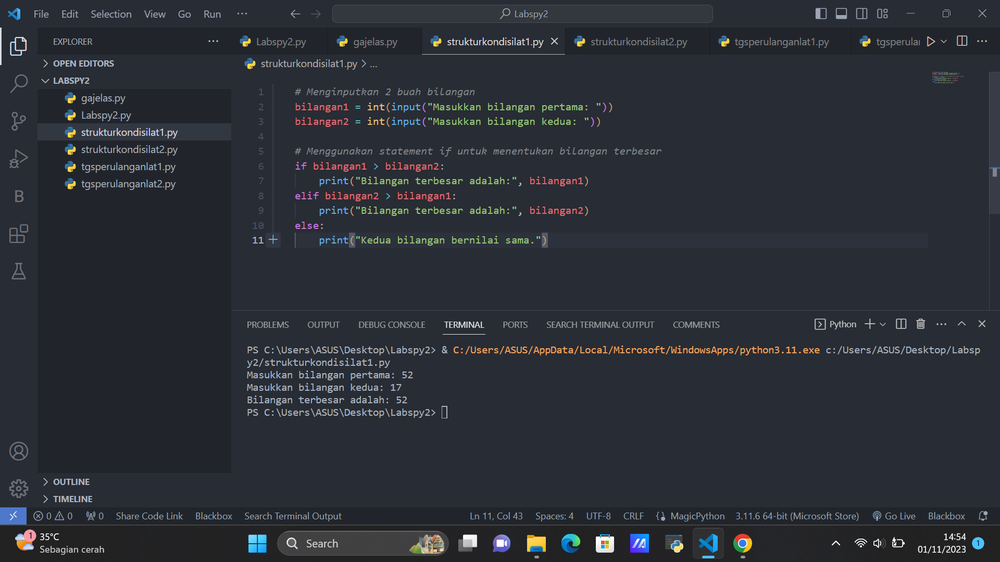

# Pertemuan 7

## Profil
| Variable | Isi |
| -------- | --- |
| **Nama** | Fadil Aditya Adzima |
| **NIM** |  312310617 |
| **Kelas** | TI.23.A.6 |
| **Mata Kuliah** | Bahasa Pemrograman |


## Tugas struktur kondisi 
### Latihan 1

*Buat program sederhada dengan input 2 buah bilangan, kemudian
 tentukan bilangan terbesar dari kedua bilangan tersebut
 menggunakan statement if.*
 
 ```Python
#Masukan input 
bil1 = int (input("Masukan bilangan : "))
bil2 = int (input("Masukan bilangan : "))

#Nilai terbesar

if (bil1 > bil2):
    print("Bilangan terbesar :",bil1)

#Nilai terkecil

if (bil1 < bil2):
    print("Bilangan terbesar :",bil2)
```
#### Hasil program



### Latihan 2

*Buat program untuk mengurutkan data berdasarkan input sejumlah
 data (minimal 3 variable input atau lebih), kemudian tampilkan
 hasilnya secara berurutan mulai dari data terkecil.*
 
 ```Python
#Masukan inputan
bil1 = int(input("Bilangan ke-1: "))
bil2 = int(input("Bilangan ke-2: "))
bil3 = int(input("Bilangan ke-3: "))
bil4 = int(input("Bilangan ke-4: "))
bil5 = int(input("Bilangan ke-5: "))

#Buat variable data
data = [bil1, bil2, bil3, bil4, bil5]

#Menampilkan data
print("Data sebelum di urutkan :", data)
list.sort(data)
print("Data setelah di urutkan :", data)
```

`list.sort` Syntax ini berfungsi untuk mengurutkan data

#### Hasil program
 


 ## Tugas perulangan
### Latihan 1

*Buat program dengan perulangan bertingkat (nested) for yang 
menghasilkan output sebagai berikut:*

```Python
baris = 10
kolom = baris

for bar in range(baris):
    for col in range(kolom):
        tab = bar+col
        print("{0:>5}".format(tab), end='')
    print()
```

Penjelasan

1. Pendeklarasian variable
```python
baris = 10
kolom = baris
```

2. Untuk perulangan baris dan kolom menggunakan `for`
```python
for bar in range(baris):
    for col in range(kolom):
        tab = bar+col        
```
3. Untuk menampikan hasil dari perulangan
     * Agar terlihat rapih menggunakan `format string` rata ke kanan sebanyak 5 karakter
     * Agar tidak membuat baris baru menggunakan `end=''` (baris)
```python
  print("{0:>5}".format(tab), end='')
print()    
```
#### Hasil program
 


### Latihan 2

*Tampilkan n bilangan acak yang lebih kecil dari 0.5.* 
*nilai n diisi pada saat runtime*
*anda bisa menggunakan kombinasi while dan for untuk
 menyelesaikannya.*

```Python
import random
print("===========================================")
print("= Bilangan acak yang lebih kecil dari 0,5 =")
print("===========================================")

jum = int( input("Masukan nilai: "))
i = 0
while i in range(jum):
    i += 1
    angkarandom = random.uniform(0,0.5)
    print("Bilangan ke :", i, " : ", angkarandom)
```

#### Hasil program


## Tugas Modul praktikum 2
### Latihan 

*Buat program sederhana dengan input tiga buah bilangan, dari ketiga bilangan
 tersebut tampilkan bilangan terbesarnya. Gunakan statement if.*
 
 ```Python
 
a = int(input("Masukan bilangan ke-1 :"))
b = int(input("Masukan bilangan ke-2 :"))
c = int(input("Masukan bilangan ke-3 :"))

max = a

if b > max:
    max = b

if c > max:
    max = c

print()
print("Nilai terbesar :", max)
```
Penjelasan
- a,b,c sebagai inputan 
- `max = a` Dekralasi variable
- `if` jika b lebih besar dari a/max, maka max = a
- `if` jika c lebih besar dari a/max, maka max = c

#### Hasil program

